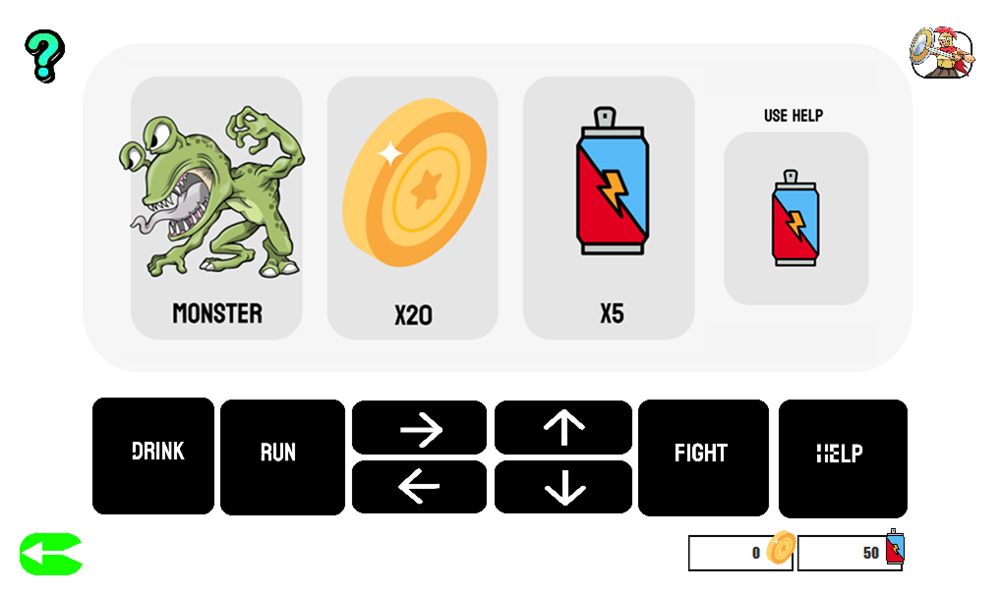

# Who Did 🎮

**Who Did** is a JavaFX-based strategy adventure game where you explore, collect, and survive against monsters.  

This project began as a **Version 1 The Bad Adventure Game** grid-based exploration game (10×10 map of rooms).  
For the final version, I **evolved the design by merging it with a casino slot machine concept**.  
Instead of walking room to room, players now spin a **slot-machine style board** in four directions (Up, Down, Left, Right).  

- 🎰 **Slot Inspiration** – visuals and mechanics draw from casino slot machines.  
- ⚔️ **Survival Mechanics** – gold, monsters, and energy draw from the original Version 1 rules.  
- 🧩 **Hybrid Gameplay** – it *looks* like a slot machine, but *plays* like an adventure.  

The result is a unique survival-slot hybrid: each spin can reward you with gold, restore energy, or throw you into combat with monsters.

## Game Screenshots

  

- **First Screen**  

  

- **Introduction Screen**  

  

- **Player Stats Screen**  

  

- **Game Time Screen**  

  

- **Start Game Screen**  

  

## Gameplay Overview

- The player enters a **machine-like arena** represented by a 3×3 spinning slot interface.  
- Each move (pressing **Up, Down, Left, Right**) spins the slots, displaying three possible outcomes:
  - 🪙 **Coin** → increases your collected gold.
  - ⚡ **Energy Drink** → restores stamina to keep playing.
  - 👹 **Monster** → drains your energy or forces combat.

- After each spin, the player can press **Drink/Collect** to gather resources.  
- If a monster is present, special choices are unlocked:
  - **Fight** → chance to defeat it and gain energy, but risk taking damage.  
  - **Run** → escape with some damage but survive.  

- The game ends when the player’s **energy reaches zero**. A **Try Again** screen lets you restart while keeping your stats.

## Core Rules

### Player
- Starts with **50 Energy** and **0 Gold**.  
- Gold increases when coins are collected.  
- Energy decreases when attacked or when running from monsters.  
- Energy can be restored by finding Energy Drinks or using the **Help button** (limited).  

### Monsters
- Appear randomly during spins.  
- Combat is chance-based:
  - **Fight** → 35% chance of winning and restoring energy.  
  - **Fail** → lose energy (−10 by default).  
- Running reduces energy by 7 but guarantees survival.

### Collecting
- Collecting after a spin adds all visible resources (coins, energy) to the player’s stats.  
- You cannot collect twice in the same spin.  

### Help Button
- Can be used **2 times per game**.  
- Restores **+10 to +30 energy**.  
- After two uses, the button is disabled.

### Death / Reset
- If energy drops to **0**, the player dies.  
- A **Try Again** screen appears.  
- Gold collected is recorded in the database and ranking is updated.

## Game Flow

1. **Login / Registration**  
   - Player enters a username + 4-digit PIN.  
   - Stats are stored in a local SQLite database (`credentialsdb.db`).  

2. **Main Game**  
   - Spin slots with the arrow keys (Up, Down, Left, Right).  
   - Collect resources, avoid monsters, and survive.  

3. **Monster Encounter**  
   - Choose to Fight or Run.  
   - Fight success restores energy; failure drains energy.  

4. **Game Over**  
   - When energy is 0, game ends.  
   - "Try Again" lets you restart.  

5. **Ranking**  
   - Database tracks:
     - **Username**  
     - **Gold collected**  
     - **Ranking** (relative to other players).  

## Features

- 🎵 **Sound & Music Toggle** – Background music and button click sounds with mute/unmute controls.  
- 📊 **Ranking System** – Tracks gold across players, shows who is on top.  
- 🖥 **User Interface** – Built with JavaFX FXML:
  - Login page  
  - Instructions screen  
  - Main gameplay screen  
  - Stats screen  
  - Try Again / Game Over  

## Summary

**Who Did** blends chance, strategy, and resource management:  
- Explore by spinning the machine.  
- Decide when to fight or flee monsters.  
- Manage limited energy wisely.  
- Compete with others through saved rankings.  

